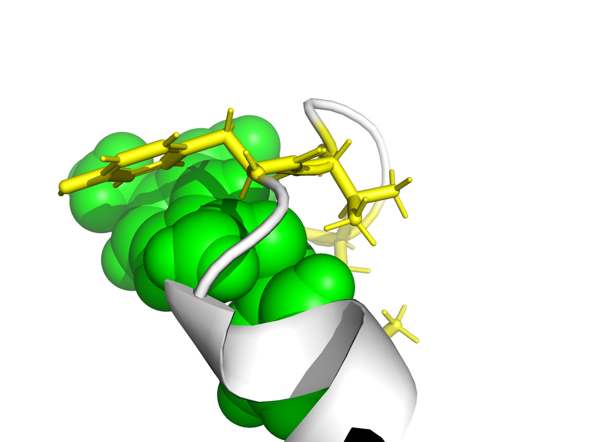
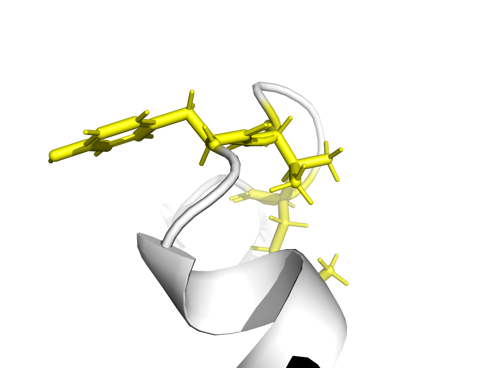
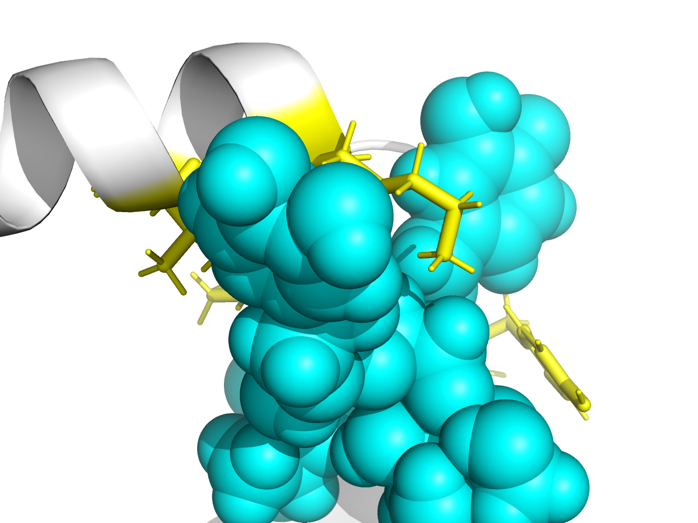

# Marine Algae Bioactive Compounds as Potential Therapeutic Candidates for Parkinson's Disease — Molecular Docking Study.

## MSc Bioinformatics & Data Science | Portfolio Project.

---

## Project Overview

This study investigates three novel marine algae-derived bioactive compounds as potential inhibitors of alpha-synuclein aggregation in Parkinson's disease (PD) using in silico molecular docking.

**Target protein:** Alpha-synuclein (PDB: 1XQ8) — primary protein implicated in PD pathology

**Novel compounds tested:**
| Compound | Source | PubChem CID |
|---|---|---|
| Ulvan | Green algae (*Ulva* spp.) | 44134405 |
| Porphyran | Red algae (*Porphyra* spp.) | 11966269 |
| Dieckol | Brown algae (*Ecklonia cava*) | 5281791 |

---

## Biological Rationale

- PD gut microbiome shows 7.5-fold depletion of *Roseburia intestinalis* and 5-fold depletion of *Blautia wexlerae* (Wallen et al. 2022)
- Marine algae polysaccharides selectively restore these depleted SCFA-producing taxa
- Alpha-synuclein N-terminal region (residues 39-48) drives early aggregation
- Hypothesis: marine algae compounds can inhibit alpha-synuclein aggregation via gut-brain axis

---

## Methods

### Tools Used
- **AutoDock Vina 1.1.2** — molecular docking
- **OpenBabel 3.1.0** — file format conversion
- **RDKit** — 3D structure generation
- **PyMOL 3.1.0** — visualisation

### Pipeline
---

## Results

### Binding Affinity Comparison

| Compound | Best Affinity (kcal/mol) | Binding Site | Key Residues |
|---|---|---|---|
| Porphyran | -4.3 | N-terminal | weak binding |
| Ulvan | -5.0 | N-terminal | TYR39, VAL40, LYS43 |
| **Dieckol** | **-6.0** | **N-terminal** | **LYS43, LYS45, VAL48, TYR39** |

### Ulvan Binding

### Porphyran Binding

### Dieckol Binding

---

## Key Finding

Dieckol (*Ecklonia cava* phlorotannin) showed strongest binding affinity (-6.0 kcal/mol) to the N-terminal domain of alpha-synuclein at residues TYR39, LYS43, LYS45, VAL48 — the region responsible for early aggregation initiation in Parkinson's disease.

---

## Repository Structure
---

## Reference

Wallen, Z.D. et al. (2022). Metagenomics of Parkinson's Disease Implicates the Gut Microbiome in Multiple Disease Mechanisms. *Nature Communications*, 13, 6958. https://doi.org/10.1038/s41467-022-34667-x

Author

Ganapathirajan
MSc Bioinformatics & Data Science
